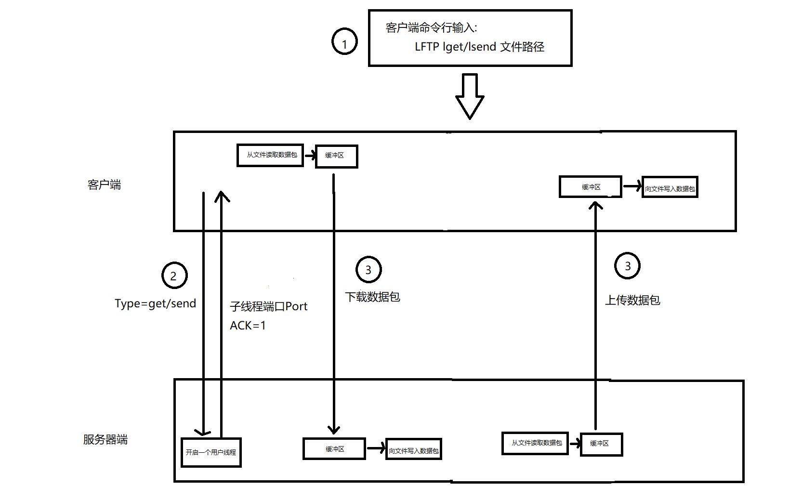
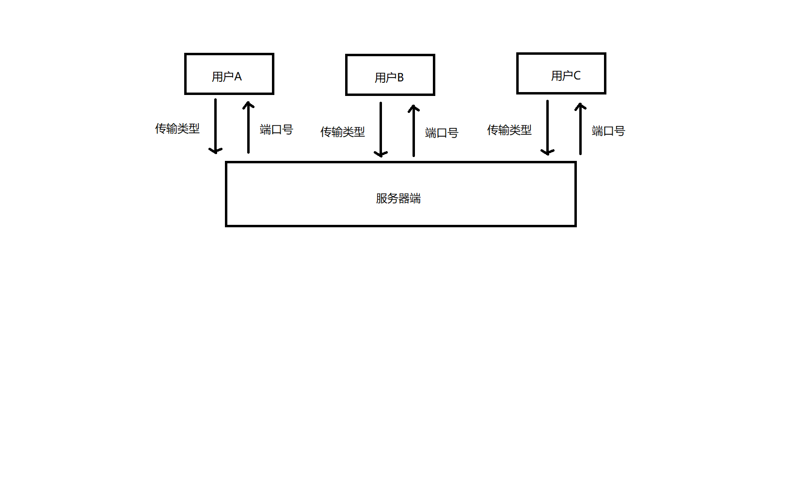
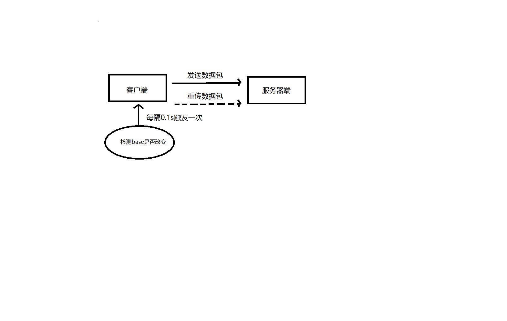
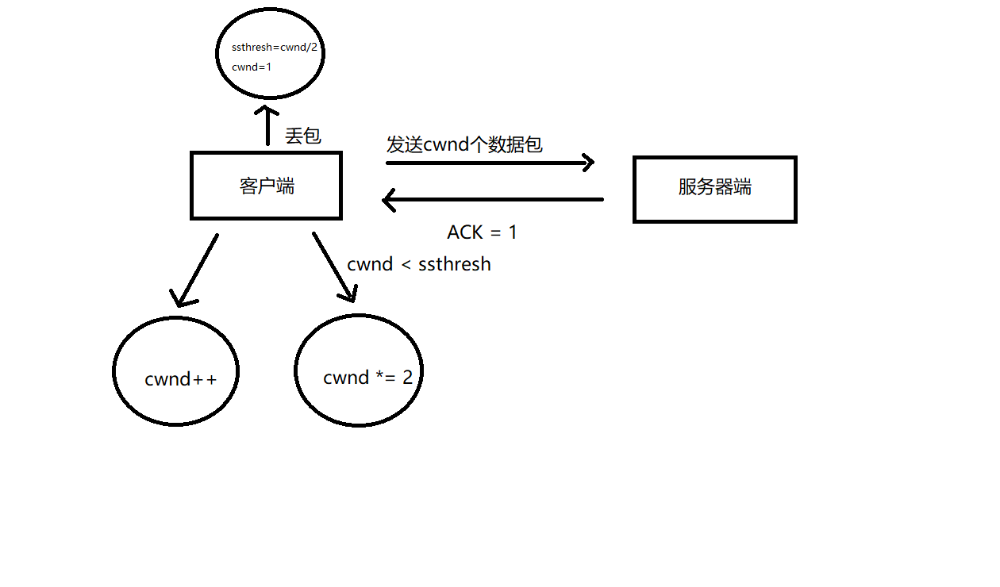

# LFTP设计文档


## 需求分析

* 使用C, C++, JAVA, PYTHON
* LFTP使用客户端-服务器端的模式
* 客户端从服务器端上传和下载文件

```
上传文件使用以下格式:
	LFTP lsend 文件路径
下载文件使用以下格式:
	LFTP lget 文件路径
```

* LFTP使用UDP作为传输层协议
* LFTP需要实现传输的100%可靠
* LFTP需要实现流量控制和拥塞控制
* LFTP能支持多个客户端同时使用
* LFTP能提供有效的Debug信息


## 整体架构 




## 项目结构

```
client文件夹:
	ClientMain.java: 客户端入口文件 
	MyClient.java: Client类
	
datagram文件夹:
	Datagram.java: 数据报文类
	Format.java:   数据报文与二进制数组之间的转换类
	
server文件夹:
	MyServer.java: 服务器端入口文件
	ServerMain.java: Server类
```


## 模块设计


### 判断文件上传或下载

```
1. 当用户输入控制台命令后, 先解析字符串获取传输类型(上传/下载)
2. 客户端向服务器端发送一个表示传输类型的数据包(包中Type=upload/download)
```


### 多用户共同使用

```
1. 服务器端接收到客户端的传输类型数据包后, 为该用户开启一个专门的子线程(端口号为port)
2. 然后向客户端发送一个响应(包中有port)
3. 客户端与服务器port端口进行数据传输
```




### 丢包检测

```
1. 开启一个每0.1s触发一次的计时器
2. 若0.1s前后发送方的最小未确认分组号没有改变, 则认为丢包, 执行步骤3; 反之, 则认为分组没有丢包
3. 当产生丢包, 发送方需要回退N步, 即将缓冲区中 [已发送最小未确认分组号, 未发送最小分组号) 之间的N个分组重新发送
```




### 流量控制

```
1. 记录发送方的已发送未确认最小分组号base, 未发送最小分组号nextSeqNum, 接收方的剩余缓冲区大小rwnd
2. 在发送方保证已发送未确认分组的数量小于接收方剩余缓冲区大小, 即nextSeqNum - base < rwnd
```


### 流水线设计

```
1. 发送方使用两个线程, 分别用于从文件中读取数据包并放入发送方缓冲区, 从发送方缓冲区取出数据包发送给接收方
2. 接收方使用两个线程, 分别用于接收数据包并放入接收方缓冲区, 从接收方缓冲区取出数据包并写入到文件
```


### 拥塞控制

```
1. 记录发送方的当前拥塞窗口大小cwnd, 阈值ssthresh
2. 发送方每次发送的数据包个数为cwnd个
3. cwnd和ssthresh的变化遵从以下规则:
  当cwnd < ssthresh, 即慢启动阶段, 每当数据包被接收方成功接收 cwnd *= 2
  当cwnd > ssthresh, 即拥塞避免阶段, 每当数据包被接收方成功接收 cwnd++
  当发生丢包, 即快速启动阶段, ssthresh = cwnd/2, cwnd = 1
```




## API文档


### MyClient.java

|                    函数                    |             参数             |    返回值     |       作用       |
| :--------------------------------------: | :------------------------: | :--------: | :------------: |
| MyClient(int sourcePort, String destinationIp) |       源端口号,  目的IP地址        |            |     创建客户端      |
|       void Upload(String filePath)       |          客户端中文件地址          |            |      上传文件      |
|      void Download(String filePath)      |          服务器端文件地址          |            |      下载文件      |
|        void send(Datagram upload)        |         发送给服务器的数据包         |            |     发送数据包      |
|            Datagram receive()            |                            | 从服务器接收的数据包 |     接收数据包      |
| void fileRead(String FilePath, int num)  | 读取文件的地址, 从文件中读取Datagram的数目 |            | 从文件中读取Datagram |
| void writeMapToFile(byte[] data, String filePath) |    要写入到文件中的数据, 写入文件的地址     |            |  将二进制数组写入到文件中  |


### Format.java

|                    函数                    |        参数         |   返回值    |        作用        |
| :--------------------------------------: | :---------------: | :------: | :--------------: |
| Datagram byteArrayToDatagram(byte[] bytes) | 要转成Datagram的二进制数组 | Datagram | 将二进制数组转为Datagram |
| byte[] datagramToByteArray(Datagram obj) | 要转成二进制数组的Datagram |  二进制数组   | 将Datagram转为二进制数组 |


### MyServer.java
|                    函数                    |     参数     |    返回值     |                    作用                    |
| :--------------------------------------: | :--------: | :--------: | :--------------------------------------: |
|           MyServer(int _port)            |   服务器端口号   |            |                  创建服务器端                  |
|  void receiveFirstPacketAndNewThread()   |            |            | 接收客户端发送的类型数据包(upload/download)并给客户端创建一个专用线程 |
|          int createSubThread()           |            |   子线程端口号   |                  创建子线程                   |
|                void run()                |            |            |                 子线程run函数                 |
|           void clientUplaod()            |            |            |                 客户端上传数据包                 |
|     void writeMapToFile(byte[] data)     | 要写入到文件中的数据 |            |               将二进制数组写入到文件中               |
|           void clientDowload()           |            |            |                 客户端下载数据包                 |
|            int avaliblePort()            |            |    端口号     |                获取第一个可用端口                 |
| void fileRead(String FilePath, int num)  |  读取文件的地址   |            |              从文件中读取Datagram              |
|    Datagram receivePacketAndFormat()     |            | 从客户端接收的数据包 |                  接收数据包                   |
| void sendPacketAndFormat(Datagram reposeDatagram) | 发送给客户端的数据包 |            |                  发送数据包                   |

